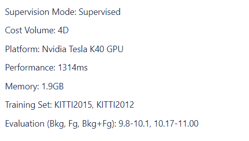

# Evaluation

## 1 Mobilestereonet Stereo

### 1.1 视差误差图

diff = abs(D_gt - D_est)，满足绝对误差小于3pixel，相对误差小于5%的像素点的集合

```python
def disp_error_image_func(D_est_tensor, D_gt_tensor, abs_thres=3., rel_thres=0.05, dilate_radius=1):
    D_gt_np = D_gt_tensor.detach().cpu().numpy()
    D_est_np = D_est_tensor.detach().cpu().numpy()
    B, H, W = D_gt_np.shape

    # valid mask
    mask = D_gt_np > 0

    # error in percentage. When error <= 1, the pixel is valid since <= 3px & 5%
    error = np.abs(D_gt_np - D_est_np)
    error[np.logical_not(mask)] = 0
    error[mask] = np.minimum(error[mask] / abs_thres, (error[mask] / D_gt_np[mask]) / rel_thres)

    # get colormap
    cols = error_colormap

    # create error image
    error_image = np.zeros([B, H, W, 3], dtype=np.float32)
    for i in range(cols.shape[0]):
        error_image[np.logical_and(error >= cols[i][0], error < cols[i][1])] = cols[i, 2:]
    error_image[np.logical_not(mask)] = 0.

    # show color tag in the top-left corner of the image
    for i in range(cols.shape[0]):
        distance = 20
        error_image[:, :10, i * distance:(i + 1) * distance, :] = cols[i, 2:]

    return torch.from_numpy(np.ascontiguousarray(error_image.transpose([0, 3, 1, 2])))
```

### 1.2 D1

mask区域内出现错误的概率， 错误可以定义为3pixel，或者5%

有效视差区域：mask = (D_gt < maxdisp) & (D_gt > 0)

```python
def D1_metric(D_es, D_gt, mask):
    D_es, D_gt = D_es[mask], D_gt[mask]
    E = torch.abs(D_gt - D_es)
    err_mask = (E > 3) & (E / D_gt.abs() > 0.05)
    return torch.mean(err_mask.float())
```

### 1.3 Thresh

误差超过阈值的概率

Thresh1：误差超过1pixel的概率

Thresh2 ：误差超过2pixel的概率

Thresh3 ：误差超过3pixel的概率

```python
def Thres_metric(D_es, D_gt, mask, thres):
    """
    BMP: Bad Matched Pixels
    """
    assert isinstance(thres, (int, float))
    D_es, D_gt = D_es[mask], D_gt[mask]
    E = torch.abs(D_gt - D_es)
    err_mask = E > thres
    return torch.mean(err_mask.float())
```

### 1.4 EPE 

mask区域内的视差L1 loss的平均值

L1 Loss也称为平均绝对值误差（MAE），是指模型预测值f(x)和真实值y之间绝对差值的平均值，公式如下：
$$
MAE=\frac{1}{N}\sum_{i=1}^{N}\left|f(x_i)-y_i\right|
$$

$$
其中：
f(x_i)和y_i分别表示第i个样本的预测值及相应真实值；
N为样本个数
$$

```python
def EPE_metric(D_es, D_gt, mask):
    """
    Pixel distance: mean absolute error (MAE)
        mean(), if reduction=‘mean’
        sum(), if reduction=‘sum’
    """
    D_es, D_gt = D_es[mask], D_gt[mask]
    # return F.l1_loss(D_es, D_gt, size_average=True) -> mean() in older version of PyTorch
    return F.l1_loss(D_es, D_gt, reduction='mean')
```

## 2 KITTI Stereo

### 2.1 D1

Percentage of stereo disparity outliers in first frame

### 2.2 D2

Percentage of stereo disparity outliers in second frame

### 2.3 FI

Percentage of optical flow outliers

### 2.4 SF

Percentage of scene flow outliers (=outliers in either D0, D1 or Fl)

### 2.5 bg (bkg)

Percentage of outliers averaged only over background regions

### 2.6 fg

Percentage of outliers averaged only over foreground regions

### 2.7 all

Percentage of outliers averaged over all ground truth pixels


## 3 Middlebury Stereo

### 3.1 bad 0.5

mask内误差大于0.5pixel的百分比

### 3.2 bad 1.0

mask内误差大于1.0pixel的百分比

### 3.3 bad 2.0

mask内误差大于2.0pixel的百分比

### 3.4 bad 4.0

mask内误差大于4.0pixel的百分比

### 3.5 avgerr

平均误差绝对值（pixel）

### 3.6 rms

均方误差（pixel)

### 3.7 A50

所有误差中的50%分位数

### 3.8 A90

所有误差中的90%分位数

### 3.9 A95

所有误差中的95%分位数

### 3.10 A99

所有误差中的99%分位数

### 3.11 time

算法运行总时间

### 3.12 time/MP

算法归一化运行时间（sec/megapixels）

### 3.13 time/GD

算法视差归一化运行时间（sec/(gigapixels * ndisp)）

****

