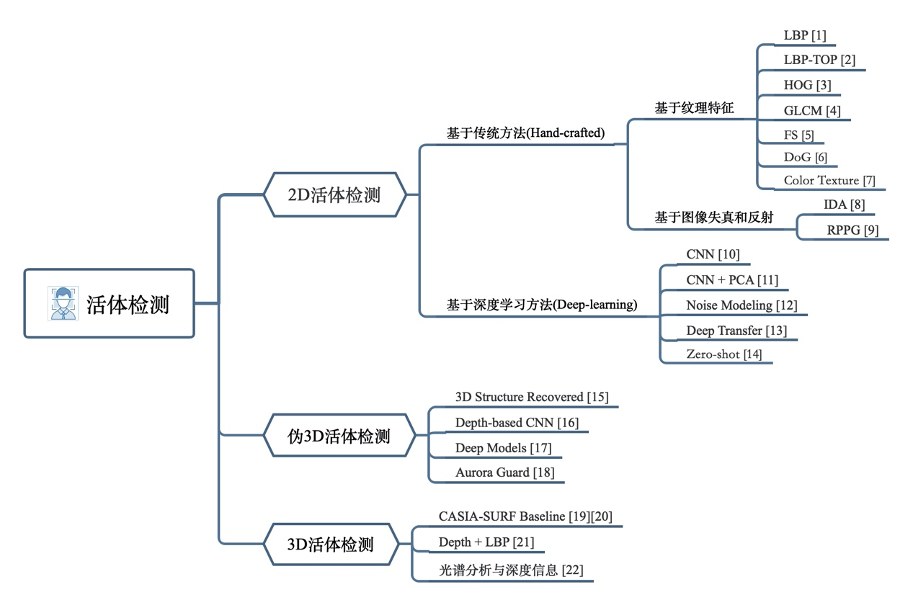
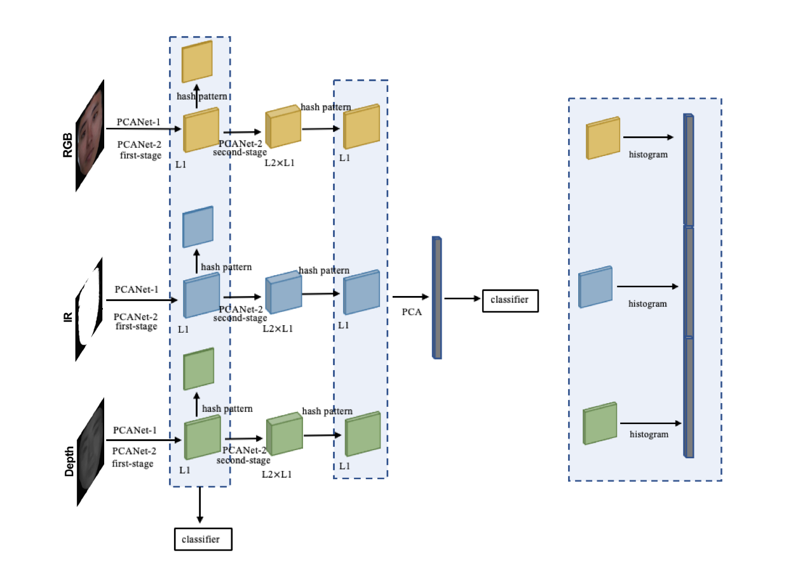

# Investigation

## Face Spoofing

### Pipeline

检测人脸→ 活体检测 → 人脸对比（和之前上传的，自拍照或证件照）→ 分析对比结果 → 返回结果（通过或不通过）

### Feature

活体检测技术即在人脸识别时要求用户进行眨眼、点头、张嘴等动作，以防止静态图像破解，支付宝、优步等应用就采用了该项技术

### Method

#### Involved in Apps

注入应用篡改程序，布置代码断点，通过不断出发人脸识别流程来触发断点，分析并修改程序存储的值，绕开活体检测；

除此之外海口通过查看当前app的数据结构，修改相关参数来篡改活体检测调用的图片；

**对策：该方式需要注入程序查看和修改app源码，需要具备一定技术门槛。**

#### Video Offense

app例如photospeak之类的app可以通过输入一张正面照片到软件中，就可以生成一段其开口说话的视频，所谓的活体检测也就不攻自破。

**对策：该方法较为简单而且成熟，但通过视频破解一定是2D的识别方案，对3D人脸识别场景应该不会奏效。**

#### 3D Modelling

除了点头、眨眼，有些人脸识别还会要求用户进行点头、摇头等动作，该识别方式是基于3D建模，构建人脸3D模型的方式来破解；

例如FaceGen和CrazyTalk等软件可以使用单张正脸的图像提取特征，重建出人脸3D模型，新模型的和原来模型都具备很高相似度。

**对策：提升传感器测量精度，构建更加精细的人脸模型，使得单张图像构建出的3D人脸模型受精度限制不足以奏效。**

#### Face Mask

美国圣地亚哥的一家人工智能公司Kneron用一个特质的3D面具，成功欺骗了包括支付宝和微信在内的诸多人脸识别支付系统，完成了购物支付程序，该团队还宣称，他们用同样的方式甚至进入了中国的火车站。

3D打印受限于以下几个关键因素：

1 3D打印精度不够，缺少眉部特征

2 3D打印通常材料比较固定，因此打印出的人脸颜色过于单一，会大大降低识别成功率

3 3D打印使用的材料若不太合适，打印出来的脸部细节会比较粗糙，需要后期手工打磨才能奏效

**对策：基于3D打印的以上特点，可以从 1 提升3D传感器精度进而提升识别的门槛 2 开发能够识别材质的相关传感器 等方面限制这种破解方式。**

#### App Defect

部分APP在使用上传人脸图像时，没有对图像数据进行签名，导致图片可以被工具截获然后篡改，而有的则是在数据报文没有加入时间戳，可以通过重放数据报文的方式来实施破解。

**对策：许多问题导致的原因都是开发者在调用第三方的人脸识别服务时，没有严格按照一个安全的规范来做，对此接入流程应当十分严谨，不应当采取为了提高用户体验而舍弃安全性的做法。**

## Face Recognition Module

人脸识别在金融、政务或公安系统中已得到广泛应用，用在智能门锁除了也得具备相同的安全性和稳定性，离线化和降低成本也是必要的。最好是同步应用当前的3D人脸识别技术，不易受姿态、表情、光线等因素影响，同时能防止照片、视频、头套等攻击，精度较高、安全性强。双目立体视觉、结构光、 ToF是主流技术，以下是相关芯片或模组：

| 品牌                  | 型号                          | 特点                                           |
| --------------------- | ----------------------------- | ---------------------------------------------- |
| 奥比中光(ORBBEC)      | MX6000                        | 已用于支付宝刷脸终端                           |
| 奥比中光(ORBBEC)      | MX6300                        | 已用于OPPO Find X手机                          |
| 瑞芯微(ROCKCHIP)      | RMSL212                       | 安全防拆                                       |
| 瑞芯微(ROCKCHIP)      | RV1126                        | 安防级ISP，Turnkey 软件+硬件方案               |
| 长光华芯(EVERBRIGHT)  | VCSEL-1W-808 CW               | 应用于ToF 3D传感方案                           |
| 商汤(SENSETIME)       | SenseID智能人脸识别模组       | 已用于TCL K6X智能门锁                          |
| 清微智能(TSING MICRO) | TX510 3D人脸识别模组          | 集3D结构光相机模组、人脸识别算法、传感器于一体 |
| 英特尔(INTEL)         | RealSense ID F450/455         | 即插即用的3D人脸识别模组                       |
| 埃瓦科技(AIVA)        | A31L18                        | 符合国家认证的金融支付级安全标准               |
| 肇观电子(NEXTVPU)     | NE-D163A                      | 集成了高精度的CVKit™ VSLAM 和3D深度计算引擎    |
| 艾芯智能(AX)          | AXON MF1                      | 3D ToF人脸识别门锁模块                         |
| 阜时科技(FORTSENSE)   | 3D结构光模组                  | 已用于多款智能门锁                             |
| 瑞识科技(RAYSEES)     | TR85C**-H12C                  | 应用于ToF 3D传感方案                           |
| 海凌科(HI-LINK)       | HLK-T210                      | 智能AI离线人脸识别模块                         |
| 勘智(KENDRYTE)        | K210                          | RISC-V指令集架构AI芯片                         |
| 小钴科技(GCO)         | AF-MD01B00-X01/AF-MD01B00-X02 | 3DM模组                                        |
| 熵基科技(ZKTECO)      | FAM520                        | 集成了人脸算法加密芯片的一款高性能人脸模组     |

## Liveness detection

当下正值新冠肺炎（COVID-19）肆虐全球之际，戴口罩成为了全民阻断病毒传播的最佳方式。然而在人脸部分遮挡或恶劣光照条件下，用户人脸识别或人脸认证的合法访问常常提示活体检测失败，甚至根本检测不到人脸。这是由于目前基于RGB等2D空间的主流活体检测方案未考虑光照、遮挡等干扰因素对于检测的影响，而且存在计算量大的缺点。

### Definition

生物特征识别系统捕获访问对象并自动检测呈现攻击（Presentation Attack, PA）的过程统称为攻击检测（Presentation Attack Detection, PAD），又称为活体检测。

### Related Research

主动检测通常需要用户根据指令完成规定动作，根据连续帧动作完成情况判断是否为活体，操作繁琐且耗时较长，用户体验感较差；而被动检测通过对单帧人脸图像判断是否为活体，以其自然性、实时性，更适用于不同应用场景。根据人脸图像数据维度分作2D活体检测、伪3D活体检测以及3D活体检测。3D活体检测是指利用双目、结构光、ToF相机，获得点云图或深度图等3D空间结构信息进行活体检测的统称。

#### 2D Liveness Detection

2D活体检测未利用任何的空间结构信息，现存的2D活体检测算法包括基于传统的特征提取与基于深度学习方法。传统的特征提取方法包括特征描述子如：

局部二值模式（LBP）[On the Effectiveness of Local Binary Patterns in Face Anti-spoofing](https://publications.idiap.ch/downloads/papers/2012/Chingovska_IEEEBIOSIG2012_2012.pdf)、

梯度方向直方图（HOG）[Robust Head-Shoulder Detection by PCA-Based Multilevel HOG-LBP Detector for People Counting](https://www.researchgate.net/publication/220931764_Robust_Head-Shoulder_Detection_by_PCA-Based_Multilevel_HOG-LBP_Detector_for_People_Counting)、

灰度共生矩阵（GLCM）[Face Spoofing Detection through Partial Least Squares and Low-Level Descriptors](http://csis.pace.edu/~ctappert/dps/2011IJCB/papers/67.pdf)等，

以及利用图像失真（Distortion）[Face Spoof Detection with Image Distortion Analysis](http://biometrics.cse.msu.edu/Publications/Face/WenHanJain_FaceSpoofDetection_TIFS15.pdf)

分析活体与非活体之间的差异性；传统算法根据活体与欺骗攻击的差异来设计特征，最后通过分类器决策；基于深度学习方法则是使用卷积神经网络将低阶特征(像素、纹理、方向等)逐层编码，获取图像的高阶表示。

在算法复杂度层面，传统的算法复杂度低但准确率相对较低。针对手动设计的差异如纹理、颜色等，在样本自身或者外部因素发生变化时，算法性能受到极大的影响，算法自身的泛化性和鲁棒性较差。如Schwartz等利用灰度共生矩阵（GLCM）表征人脸图像灰度空间内方向、变换快慢和幅度的综合信息。基于深度学习算法的复杂度和准确率相对较高，

Yang等[Learn Convolutional Neural Network for Face Anti-Spoofing](https://arxiv.org/pdf/1408.5601v2.pdf)

利用卷积神经网络（CNN）进行端到端的有监督学习，将活体检测当做一个二分类任务，自动提取图像特征，并直接用参数表达。与传统方法不同的是，深度学习算法的特征理解具有不可解释性，但是其自适应特征提取过程在一定程度上增强活体检测算法的泛化性能。同时深度神经网络也存在的过拟合、梯度消失、梯度爆炸等一系列问题。

#### Pseudo-3D Liveness Detection

伪3D活体检测指基于RGB图像使用深度估计算法间接得到空间结构信息的活体检测算法。

Wang等[Face Liveness Detection Using 3D Structure Recovered from a Single Camera](http://www.nlpr.ia.ac.cn/2013papers/gjhy/gh95.pdf)

从RGB图像中恢复稀疏的3D面部结构以进行活体检测，这也是首次将估计的3D结构信息用于活体检测。

Atoum等[Face Anti-Spoofing Using Patch and Depth-Based CNNs](http://cvlab.cse.msu.edu/pdfs/FaceAntiSpoofingUsingPatchandDepthBasedCNNs.pdf)

则利用RGB图像估计深度信息，设计双流CNN网络结合颜色纹理与深度结构特征实现活体检测算法，其估计3D深度信息的过程是：将训练图像从RGB空间转化到HSV、YCbCr空间，利用3D脸部匹配算法与3DMM模型计算深度图像标签。伪3D活体检测利用RGB图像估计深度信息，虽然不需要额外的深度相机设备进行采集3D数据，但是除了存在计算量大的缺点之外，最关键的是估计数据与实测数据存在较大偏差，直接影响了活体检测的准确性。

#### 3D Liveness Detection

3D活体检测则直接利用深度相机获取空间结构信息实现活体检测算法。

Wang等[Robust face anti-spoofing with depth information](https://www.sciencedirect.com/science/article/abs/pii/S1047320317301773)

利用Kinect深度相机采集的深度信息，通过提取深度图的LBP特征以及CNN学习到RGB图像的纹理特征，再送入SVM分类完成活体检测。Zhang等

[CASIA-SURF: A Large-scale Multi-modal Benchmark for Face Anti-spoofing](https://arxiv.org/pdf/1908.10654v2.pdf)

[A Dataset and Benchmark for Large-scale Multi-modal Face Anti-spoofing](https://arxiv.org/pdf/1812.00408v3.pdf)

公开了大尺度、多模态数据集CASIA-SURF，该数据集利用Intel RealSense SR300结构光相机采集深度图和红外图，提出融合RGB、深度图与红外图的多流ResNet基准算法。该算法与前两类活体检测算法相比，其专注于人脸面部区域，消除背景对检测的干扰。作为经典的3D活体检测算法，直接使用深度相机获取空间结构信息，极其容易识别屏幕或者打印攻击。同时结合其他模态（如红外图、RGB图等），为活体检测任务提供更多准确的区分性特征，还可以降低了算法的运算复杂度。但该基准算法只针对了6种纸张打印欺骗攻击方式展开，未考虑恶劣条件下的活体检测，而且仍存在计算复杂度较大的问题。此外相较于结构光、双目视觉等消费级深度相机，ToF相机具有更强的抗干扰性能，能够准确表征人脸的立体空间结构特性，符合活体检测的应用场景条件。

### ToF Depth Camera

ToF全称为Time-of-Flight，直译为飞行时间。飞行时间法通过连续向目标发送光脉冲，用传感器接收从物体返回的光，通过探测光脉冲的飞行（往返）时间来得到目标物距离。

由于ToF相机不需要像双目相机一样进行匹配，也不需要像结构光相机一样进行编码，ToF相机的计算相对简单，帧率可达上百fps。在测距范围和精度方面，ToF表现非常均衡，解决了结构光相机远距离受限和双目相机近距离精度不足的问题。同时，ToF作为一种采用主动测距方式的3D相机，在黑暗环境中也能正常工作。高频调制的光源使其在强光环境下的抗光干扰表现优异，ToF相机具有明显的优势。

### 3D Liveness Detection Algorithm

#### Algorithm Framework

PCA网络（PCANet）[PCANet: A Simple Deep Learning Baseline for Image Classification?](https://arxiv.org/pdf/1404.3606v2.pdf)

1. 空间层次上的预注意机制。特征学习专注于人脸区域，消除背景对检测的干扰，提取更高区分度的识别特征。
   鲁棒人脸特征提取。
2. 作为层次化鲁棒特征提取的经典网络，将CNN的卷积层引入经典的“特征图—模式图—柱状图”特征提取框架，通过层次化卷积与编码，逐阶段形成图像的高阶特征表达。
3. 多模态数据融合。本方法融合RGB图、深度图、强度图三种模态数据，不同模态数据在PCANet中学习到的特征互补，可有效地区分活体与非活体。

我们提出3D活体检测算法框架主要基于特征级的多模态融合策略，

首先FaceBoxeshttps://arxiv.org/pdf/1708.05234v4.pdf

人脸检测器完成人脸检测。非极大抑制(NMS)算法用于选取候选的人脸区域，根据图像中的像素面积大小得到最终的待检人脸区域。再以多模态PCANet为网络主干，对比分析一层PCANet（PCANet-1）与两层PCANet（PCANet-2）在多模态活体检测任务中融合的效果。具体地，通过PCA滤波器核卷积与编码，学习多模态数据（RGB、IR、Depth）的高阶特征，融合的直方图统计特征送入到SVM等统计学习分类器完成最终检测。算法框架如图所示：

