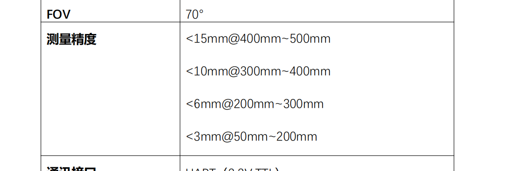

# Line Structured Light

- 矩形棋盘格，避免激光线卡到棋盘格角点缝里
- 线激光500mm，1%
- 基于拍照的原则，CMOS对成像的点或线比较敏感，散射的那部分能量信号很弱，可以忽略
- 结构光基于灰度光斑建立起图像和三维世界的关系
- 

## 1 Calibration

## 2 Measurement

- 提取质心：灰度重心法：灰度做权重，坐标做值

### 3 Requipment

