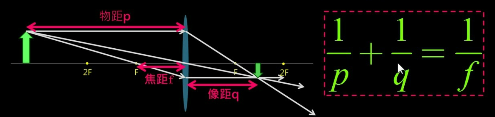
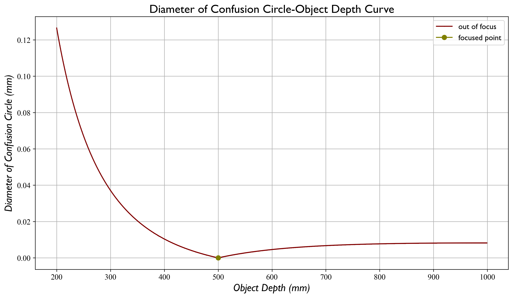

# Optics & Imaging

- 光心在像平面的前面，一般位于第一片lens和第二片lens之间
- 无穷远处的光线汇聚在像方焦点，这一原理决定了光圈的大小，物距像距焦距之间的关系

## 

## 1 Camera Intrinsic

### 1.1 Focusing

调焦是否会影响相机内参：对焦过程中透镜系统中的焦距f肯定是不变的，只不过在小孔成像模型当中，相机模型中描述的f其实是光学系统中的像距v，对焦过程中v是在变的，所以响应的相机模型中的f在变化，而像元大小μ是sensor的物理属性，肯定是不变的，所以是由于像距v的变化造成了最后内参fx的改变

### 1.2 Up/Down-sampling

### 1.3 Digital Zooming

### 1.4 Optical Zooming

### 1.5 Undistortion

### 1.6 Rectification

## 2 Depth of Field

前景深物距：

后景深物距：

浅景深：

后景深：

## 3 Circle of Confusion

失焦弥散圆直径与物体的深度之间的关系：

